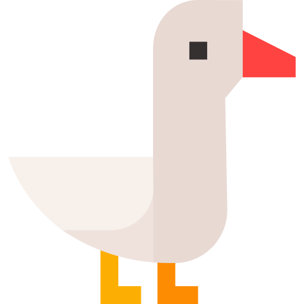

# VM GOOSE

<br><br><br>
Meet VM Goose — a little goose with a whole Ubuntu desktop hiding in the cloud.

VM Goose does the heavy lifting. He sets up an Ubuntu 24.04 virtual machine in AWS, installs an XFCE desktop and Firefox, and gets everything ready for remote access over RDP.

VM Goose also keeps things tucked away safely — only your IP address is allowed through, so random internet visitors are politely kept out of the nest.

In short:

**You provide the updates in the Terraform code.**
**AWS provides the cloud.** ☁️
**VM Goose provides the desktop.** 🪿

Deploy it, connect to it, and enjoy your very own cloud-based goose-powered workstation.

<br><br><br>

# AWS Browser VM (Terraform)

Creates an Ubuntu 24.04 virtual machine in AWS with an XFCE desktop and Firefox.
You connect to it with Remote Desktop (RDP), and only your IP address is allowed in.

## Files

| File | Purpose |
|---|---|
| `versions.tf` | Terraform and provider versions, AWS provider settings (account guard, region, tags), optional S3 state |
| `variables.tf` | Declares every input variable |
| `terraform.tfvars.example` | **The file you edit.** Copy it to `terraform.tfvars` |
| `network.tf` | VPC, public subnet, internet gateway, route table, security group |
| `iam.tf` | IAM role so you can get a shell with SSM Session Manager (no SSH needed) |
| `main.tf` | Ubuntu AMI lookup, random password, EC2 instance, Elastic IP |
| `user_data.sh.tftpl` | First-boot script that installs the desktop, Firefox and xrdp |
| `outputs.tf` | IP address, username, password, and other values printed after deploy |

## What you need to update

All of these are in `terraform.tfvars` (copy it from `terraform.tfvars.example`):

| Setting | What to put | How to find it |
|---|---|---|
| `aws_account_id` | Your 12-digit account ID | `aws sts get-caller-identity --query Account --output text` |
| `aws_region` | Region for the VM, e.g. `eu-west-2` | Your choice |
| `aws_profile` | Your AWS CLI profile name, or delete the line | `aws configure list-profiles` |
| `allowed_rdp_cidrs` | Your public IP followed by `/32` | `curl -s https://checkip.amazonaws.com` |
| `owner` | Your name or email (just a tag) | Optional |

Optional: to keep Terraform state in S3, uncomment the `backend "s3"` block in `versions.tf` and set the bucket name and region.

> The account ID `099720109477` in `main.tf` belongs to Canonical, which publishes the Ubuntu images. **Don't change it.**

## Before you start

- [Terraform](https://developer.hashicorp.com/terraform/install) 1.5 or newer
- [AWS CLI v2](https://docs.aws.amazon.com/cli/latest/userguide/getting-started-install.html), with credentials set up (`aws configure` or `aws configure sso`)
- An RDP client:
  - **macOS / Windows:** "Windows App" (formerly Microsoft Remote Desktop)
  - **Linux:** Remmina
- Optional, for shell access: the [Session Manager plugin](https://docs.aws.amazon.com/systems-manager/latest/userguide/session-manager-working-with-install-plugin.html)

## Deploy

```bash
cd aws-browser-vm
cp terraform.tfvars.example terraform.tfvars   # then edit the values
terraform init
terraform plan
terraform apply
```

**Wait about 5–10 minutes** after `apply` finishes. The VM is still installing the desktop and Firefox in the background.

## Connect

```bash
terraform output rdp_address
terraform output desktop_username
terraform output -raw desktop_password
```

1. Open your RDP client and add a PC using the `rdp_address`.
2. Log in with the username and password.
3. Accept the certificate warning. The VM uses a self-signed certificate.
4. Double-click **Firefox** on the desktop.

If RDP doesn't connect:

- Check that setup has finished. Open a shell with the command from `terraform output ssm_shell_command`, then run `sudo tail -f /var/log/user-data.log`. Look for `Browser VM setup complete`.
- Check that your public IP hasn't changed. If it has, update `allowed_rdp_cidrs` and run `terraform apply` again.

## Cost

These prices are for eu-west-2 and are approximate:

| Item | Rate | Monthly (always on) |
|---|---|---|
| t3.medium instance | ~$0.047/hour | ~$34 |
| 30 GB gp3 disk | – | ~$3 |
| Public IP | ~$0.005/hour | ~$3.60 |

**To save money, stop the VM when you're not using it.** While it's stopped you pay only for the disk and IP:

```bash
aws ec2 stop-instances  --instance-ids $(terraform output -raw instance_id)
aws ec2 start-instances --instance-ids $(terraform output -raw instance_id)
```

## Tear down

```bash
terraform destroy
```

## Security notes

- RDP is open only to the IPs in `allowed_rdp_cidrs`, and port 22 (SSH) is not open at all.
- The desktop password is stored in the Terraform state file. Keep `terraform.tfstate` private, or use the encrypted S3 backend. You can change the password on the VM with `passwd`.
- For even tighter security, you can remove the RDP ingress rule entirely and tunnel RDP through SSM instead:
  ```bash
  aws ssm start-session --target <instance-id> \
    --document-name AWS-StartPortForwardingSession \
    --parameters '{"portNumber":["3389"],"localPortNumber":["13389"]}'
  ```
  Then connect your RDP client to `localhost:13389`.
